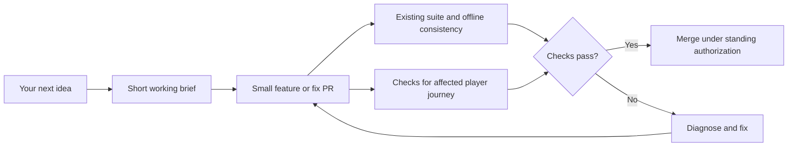

# Engineering and product council consultation

Date: 2026-10-04. Audited revision: [`e76666f`](https://github.com/karmiphuc/ashen-company/commit/e76666f).

Council: **Tech Lead — Sol 6.1 High**; **PM — Astra 6 Medium**. Each independently inspected the repository and then cross-reviewed the other role's recommendations. This document records their consensus and the lead agent's verified baseline. It is a consultation, not an implementation of CI, branch protection or architecture changes.

## Decision

Keep the dependency-free static game and its existing seeded tests. Make the quality signal trustworthy, preserve a few actual player journeys, and extract small seams as requested features need them. Do not make a rewrite, framework migration or formal planning process a prerequisite for the next idea.

Your spontaneous requests remain the feature backlog. The agent should turn each into a short working brief and proceed, using the standing PR/auto-merge authorization once applicable checks pass. Additional questions are needed only when a consequential ambiguity changes the intended result.

## What the audit established

| Evidence at the audited revision | Consequence |
| --- | --- |
| Full `npm test`: **869 tests, 858 passed, 11 failed**, no skips/cancellations; approximately 145 seconds in this cloud environment | Current main is not green. Passing a focused subset cannot establish a clean release baseline. Runtime depends on machine and scenario load. |
| GitHub API reports only the dynamic `pages-build-deployment` workflow; `main` has `protected: false`; no tracked validation workflow | Deployment is not a regression gate. The existing checks currently depend on whoever delivers the PR. |
| `src/engine.js` has 6,009 lines; world/combat mutation, AI orchestration and save validation share it | Changes often cross boundaries. Size alone is not a defect, but shared responsibilities widen review scope. |
| Native Node tests already exercise seeded combat, atomic transactions, legacy fixtures and save/reload between actions | Build on this coverage instead of replacing it with another test framework. |
| Runtime assets are discovered and content-hashed; offline tests compare committed `sw.js` with generated output | Keep this mechanism and enforce its existing consistency check. |
| UI tests often inspect HTML; recent browser verification scripts were run outside the repository | Structural assertions cannot prove screen visibility, touch interaction or scroll behavior. Preserve a small reproducible browser suite. |
| `package.json` is 0.50.18, README opens at 0.48.9 and verification at 0.48.0; Play still describes 12 recruits and a 14×8 field | Current instructions and historical verification need clearer separation. Past green results are historical evidence, not today's release signal. |
| Physical iPad Safari offline installation/save retention remains unverified in README | Chromium evidence must not be presented as physical iPad validation. Keep the device check small and explicit. |

Source anchors: [development instructions](../README.md#development), [current play instructions](../README.md#play), [verification history](VERIFICATION.md), [step/reload equivalence](../tests/tactical-compat.test.js), [historical combat fixtures](../tests/weapon-skills-compat.test.js), [offline generation](../tools/build-cache.mjs), [offline verification](../tests/offline.test.js).

## Repair the baseline before trusting auto-merge

The run reproduced these exact failures on unchanged audited main:

| File | Failing tests |
| --- | --- |
| `tests/battle-camps.test.js` | mounted ground anchors follow the actual shared plate and equipment frame for all species |
| `tests/helmet-alignment.test.js` | all helmet crowns and horns fit inside the portrait while every face and named variant keeps its head anchor |
| `tests/shield-ui.test.js` | company sheet shows active and reserve shield condition, including a broken shield |
| `tests/weapon-placement.test.js` | every shield and one-handed family share the right hand while the center chest stays clear; tilted sword, mace, spear, axe and cleaver art fits the frame at every mount height; every two-handed melee family stays in proportion to the pawn and fits, including named mounted variants; every mount stays low on the right, visibly supports the rider and remains visible behind every shield |
| `tests/progression.test.js` | level rolls are stored for all eight stats and never change on reload or gear swap; three distinct choices apply their own rolls atomically and preserve wound deficit; training is blocked during battle and level 30 XP stays saveable; save validation rejects forged, duplicate, out-of-order, and out-of-range progress |

The seven portrait/shield assertions overlap deliberate recent changes to natural character size and removal of reserve-shield health display. That is a diagnosis lead, not proof that every failing assertion should be removed. Compare intended art/layout contracts with rendered results, then repair only disproven expectations while preserving anchors, layering, asset identity and gameplay durability checks.

The progression tests rely on a naturally simulated starter fight creating a level-up. Diagnose the changed XP/fixture behavior. Give attribute-training tests a valid, explicit earned-level setup; retain a separate real combat → earned XP → level offer → training → reload journey. Do not simply delete the tests or reduce their assertions.

Prefer repairing this small baseline immediately. Do not normalize “11 expected failures,” suppress a test directory or claim full-suite success from focused tests. If a temporary exception is unavoidable, record the exact test, reason, owner and removal condition; new failures, save loss and new combat stalls remain blockers.

## A small delivery system

The working brief is two to four sentences: intended visible outcome, affected screens/saved state, and two or three acceptance examples. It is an aid to implementation, not another user approval gate. Save corruption, broken core play and an unreliable quality signal take priority; otherwise the user's next request can move directly to the front.

For runtime, UI and asset PRs, the common automated gate should run **Node 22, `npm test`, and `git diff --check`**. The full suite already checks committed offline output. CI must inspect that output; silently regenerating a stale worker before testing can conceal the missing committed update. Contributors run `npm run prepare-offline` and commit the result when runtime/assets change. Docs-only PRs can use documentation checks without rerunning unchanged gameplay.

After repairing the baseline, add one validation workflow and make it a required merge check. Run on PR updates and main, and ensure the merge policy covers the final revision integrated with current main, rather than a previously tested head. Honor standing auto-merge authorization when required checks pass; do not ask again for routine merges. This report does not modify GitHub settings.

Additional evidence follows the **seam touched**, not the request's apparent size:

| Change touches | Additional acceptance evidence |
| --- | --- |
| Copy/local layout/timing | Relevant existing checks; inspect rendered output when visual. No compulsory new unit test for trivial CSS. |
| Global CSS, navigation, `app.render` | Enter affected screens through real controls, assert visible/reachable actions, scroll, reopen/reload; tablet and narrow layouts. A footer in generated HTML is insufficient. |
| Economy, retinue, tactic or skill | A seeded actual-flow regression plus relevant neighboring rules; quote equals receipt, failed actions are atomic, save round-trip when state changes. |
| AI movement/weapon switching | Multiple actions and rounds; representative loadouts/terrain; periodic reloads; reachable fighters make productive progress. |
| Save format or offline update | Historical campaign and active-battle fixtures; repeat import; complete update then offline reload with retained progress; failed-save/incomplete-update paths. |

## Preserve the fun while testing correctness

Use a few seeded encounters to review pacing and useful choices: melee-heavy, ranged-heavy, shielded/mounted and mixed companies. Look for an ability actually being selected, sensible ranged/melee reserve behavior, interesting counterplay, and rewards that remain worthwhile without an economy exploit.

Treat those comparisons as advisory balance evidence. Do not make a narrow win-rate threshold a release gate or assume every encounter must end in victory. Objective failures can be gated: illegal actions, duplicate rewards, out-of-range resources, repeated unproductive movement in named scenarios, or failure to finish a curated encounter within its declared action budget.

Examples that should stay easy to verify:

- **Cinematic Flee:** escape steps and their reactions stay at fast movement timing; non-fleeing attacks and skills keep cinematic treatment.
- **Roster/stash:** roster is visible on world, combat and company screens, content/actions are reachable, and stash scroll survives the intended layout. Include short tablet landscape.
- **Retinues:** display and collection agree; reload preserves fractional food/tools; local resale cannot mint crowns; unsuccessful hires change nothing.
- **New skill/tactic:** fighters choose and execute it through actual battle advancement; turns progress, reserve weapon choices remain sensible and historical active fights retain their rules.

## Incremental maintainability

Keep `engine.js` as the public facade initially. Extract only a characterized boundary and avoid mixing a behavior-preserving extraction with balance tuning.

1. **Event identity and presentation:** events currently use labels such as `skillName: 'Flee'` for rendering and save acceptance. Introduce stable identity/category alongside display labels when this seam is next changed. Update producers, renderer/audio and normalization together; retain old-event fallback. Test Flee, Reload, holds, attacks and reactions. Do not immediately rewrite every event.
2. **AI decision helpers:** follow `src/tactical-ai.js`'s supplied-input/scoring approach. Extract one pure legality/scoring helper when a feature encounters it; preserve AP, fatigue, RNG ordering, mutation order and legacy dispatch. Continue using multi-round behavior tests, not scoring tests alone.
3. **Save normalization:** extract narrow helpers after real fixtures characterize them. Preserve independent capability flags and historical snapshots. Moving the entire validator or collapsing rule versions is a higher-risk project, not a prerequisite.

Centralize repeated test setup only when it demonstrably causes mistakes. A helper must construct valid state without bypassing the rule being tested. Extend existing catalog checks as new entries require them: stable IDs, executable skills, valid item references, asset presence and offline inclusion.

Avoid a runtime framework/server migration, a generic plugin architecture, a blanket snapshot rewrite or a fixed “tech debt percentage.” Add development-only browser tooling when implementing the repeatable journeys; keep the shipped game static.

## Recommended implementation PRs, in order

| PR | Concrete result | Done when |
| --- | --- | --- |
| 1. Restore the baseline | Diagnose/fix the 11 failures and reconcile current-play documentation | Full suite green; changed assertions justified; progression and historical-save coverage retained. |
| 2. Enforce existing checks | One validation workflow and required merge status | A deliberate broken assertion and stale worker each fail; a clean runtime PR passes; auto-merge respects final integrated revision. |
| 3. Preserve two browser journeys | Combat entry → speed/tactics → visible roster → pause/reload → results; company/equipment progression → export/import → restored state | Real controls work at tablet/narrow widths, content stays reachable, no browser errors; fixtures and scripts are committed and reproducible. |
| 4. Strengthen AI scenario diagnostics | Extend existing movement-loop scenarios, with bounded curated encounters and periodic reloads | Failures print seed, tactic, roster and recent actions; productive movement/attack expectations hold without universal victory claims. |
| 5. Stabilize event semantics | Optional stable IDs/categories with legacy interpretation | Flee remains fast, skills remain cinematic, current round-trips retain fields and historical outcomes stay intact. |
| 6. Extract a touched helper | One smaller decision/normalization seam behind the facade | Existing behavioral/compatibility outcomes match; no balance tuning mixed into the extraction. |

Do the first three early. The later work can accompany actual feature requests rather than holding them behind an architecture program. Keep PR descriptions brief: what the player can now do, what was checked at which revision, and any relevant remaining device limitation. Keep verification history, but add a current source of release evidence instead of carrying old “all tests pass” claims forward.
