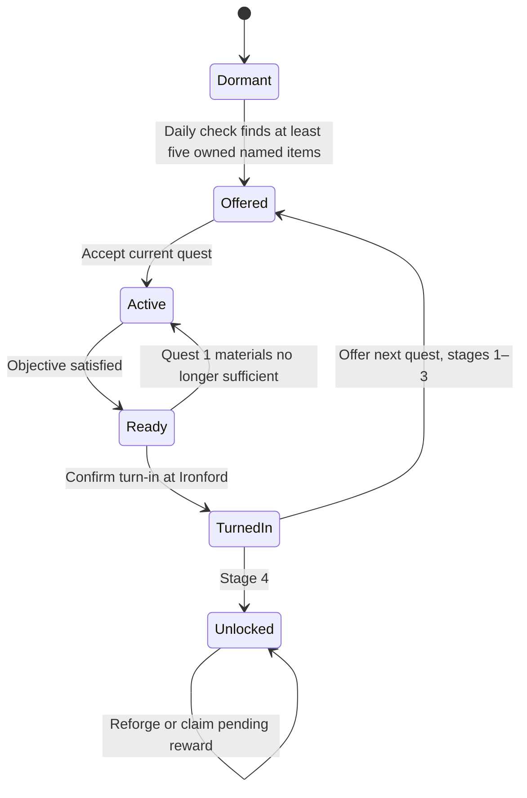

# Legendary blacksmith: The Rekindled Forge

Status: proposed implementation specification. This change designs the quest chain and service; it does not add playable quests or import the artwork yet.

## 1. Player promise and design defaults

Help **Odran, the Last Ember**, restore his workshop in **Ironford** through four sequential side quests. Completing the fourth permanently unlocks **Reforge legacy**: destroy one named item from the stash and transfer its named enhancements onto another compatible stash item. Weapon class does not restrict weapon-to-weapon transfers.

The chain runs alongside ordinary contracts. Its progress, encounters, rewards and journal entry are independent of `state.contract`, contract offers and `contractSerial`. An active contract never blocks starting, advancing or turning in the chain; the chain never occupies or replaces the contract slot. Ordinary rules still allow only one ordinary contract at a time.

Proposed defaults, centralized for balancing:

- Trigger only when a once-per-campaign-day check finds **at least five owned named/famed item copies**. The check permanently reveals quest 1 and Odran's Ironford interaction; accepting remains optional. No additional day, renown or current-contract prerequisite applies.
- No quest deadlines, automatic failure or permanent failure from retreat. All four stages require an explicit conversation with Odran to turn in and advance.
- Transfer **all rolled bonuses** from one sacrificed item, as confirmed by the user. Include its existing legacy named craftsmanship in the same single enhancement package; there is no individual-bonus selection step.
- Both items must be in the stash. Ordinary and named recipients are allowed. A transfer **replaces** the recipient's previous named enhancements, giving it one donor package; repeated reforging never stacks packages.
- Body armor -> body armor; helmet -> helmet; weapon -> any weapon, regardless of class, range, handedness or culture. Shields, attachments, accessories and mounts are outside this initial service.
- First transfer is free. Subsequent transfers cost **1,000 crowns**, with no extra crafting currency, material grind, cooldown or random failure. Quest 4 grants the free-use entitlement; merely opening or quoting the service cannot consume it.
- Use existing human and ancient-armory enemy definitions. Add no races, enemy equipment collections or new regional factions.

### Daily discovery trigger

Count physical item copies with resolved rarity `named` or `famed` across the stash and all living company members' equipped gear, reserve weapon sets and other owned equipment slots. Five copies qualify even if their definition IDs are identical. Count each physical copy once, rather than counting its appearances in multiple UI views. Named shields also count toward discovery even though shield reforging is outside the initial service. Market stock/buybacks, catalog previews, enemy/allied equipment, unclaimed loot and pending reward entitlements do not count as owned items.

While the chain is dormant, run one eligibility scan at the daily campaign boundary, once daily processing has established the current owned inventory. Store `lastEligibilityCheckDay` so waiting, hourly world updates, travel, visiting Ironford, inventory changes, opening menus and reloading on the same day do not repeat the scan. Buying or claiming the fifth item after that day's scan makes the player eligible at the **next daily check**, rather than immediately. The check is a campaign/world update action, never a rendering side effect.

For new campaigns or old saves without this feature, initialize all quests locked and the check marker unset. Run the first check at the first safe world update for the current campaign day, then use the daily boundary. If an active battle prevents that check, defer it until the first safe world update after the battle. Ordinary save reloads preserve the marker and cannot manufacture another same-day check. Multi-day travel/waiting processes each crossed daily boundary through the same daily hook; do not rescan once per simulated hour.

On the first qualifying check, latch `triggeredDay`, offer quest 1, add the side-quest journal entry and announce once: “Word of your collection has reached Odran, the Last Ember. Seek his forge in Ironford.” Triggering does not accept the quest, consume items, require the player to be in Ironford or interfere with a contract. Ironford's temporary service blockade does not prevent discovery; it still prevents interaction until services reopen.

After discovery, stop scanning item ownership for this chain. Selling, losing or sacrificing items below five never hides the offer, resets progress or locks the completed service. The threshold is a one-time discovery condition, not an ongoing requirement for quests or reforging.

## 2. The four quests

| Stage | Quest and story | Exact objective | Turn-in reward |
| --- | --- | --- | --- |
| 1 | **Cold Hearth.** Odran's bellows are torn and his furnace stands cold. He will work again if someone restores the workshop. | Deliver **8 Iron**, **6 Timber** and **10 Tools** to Odran. Goods come from existing cargo/markets; tools come from company supplies. Preview the full requirement and consume everything together only on explicit turn-in. | 400 crowns; restored forge artwork/state; offer quest 2. |
| 2 | **Anvil in Chains.** Raiders stole the master's anvil and now use it to break captured arms. | Defeat a dedicated nearby human brigand encounter, **Anvil Thieves**, then return with the anvil. Default roster: 8 existing regional brigands at difficulty 2. The anvil is a quest flag, recovered only when the victory result is claimed. | 700 crowns; offer quest 3. |
| 3 | **The First Temper.** A surviving tempering plate lies in an ancient furnace. Its buried custodians still guard it. | Defeat **The Buried Furnace**, default 10 existing ancient-armory enemies at difficulty 3; recover the tempering plate and bring it to Odran. Reuse ancient equipment and existing undead behavior. | 1,000 crowns; offer quest 4. |
| 4 | **A Master's Oath.** An armed collector holds Odran's stolen pattern-book. The book teaches how a weapon's exceptional workmanship can survive its destruction. | Defeat **The Collector's Guard**, default one existing human champion plus 9 existing elite human guards at difficulty 3. The champion must be killed, rather than escape; this design adds no capture mechanic. Claim the result, recover the pattern-book, and return to Odran. | Permanently unlock **Reforge legacy**, one free transfer, and one guaranteed named Arming Sword for trying the service. No extra fifth quest or compulsory sacrifice. |

Short dialogue establishes each objective and repeats the mechanical reward. Final dialogue: “Steel can break. Good work need not die with it. Bring me a named piece and the item that should inherit its craft.”

### Encounter and reward rules

1. Accepting each combat stage creates one persistent encounter identity and snapshots its roster, seed, terrain, location and difficulty. Reloading, waiting or taking contracts cannot reroll it. Default counts above include the champion; apply no second scaling pass at battle start. Playtest these rosters before adjusting centralized balance values.
2. Generate reachable, clear exterior positions using current world navigation rules, outside settlement service boundaries and occupied map objects. Quest 2 should be within roughly one day's travel of Ironford; quests 3 and 4 may extend to neighboring regions. Pick from eligible locations deterministically, save the choice, and use a tested nearby fallback if no candidate is reachable. Do not create inaccessible positions by applying raw coordinate offsets.
3. Each is a dedicated side-quest site, rather than a normal respawning camp, contract objective or Ashen Winter encounter. It appears only while its stage is active and disappears after successful result claiming. NPC patrols do not clear or consume these objectives.
4. Retreat, defeat with company survivors, or the collector escaping leaves the stage active. Persist encounter casualties using existing encounter survivor semantics; the collector keeps his trophy if he escapes. Retry the saved surviving roster without rerolling gear. If any current defeat handling would discard all quest enemies despite an unsuccessful objective, explicitly retain the surviving collector and retry state.
5. Ordinary battle loot, XP, injuries and casualties retain their existing rules. Quest-object recovery is separate from loot selection: donating items, a full stash or choosing “continue” cannot discard the anvil, plate or pattern-book. Quest objects have no stash entry, cargo weight, sale value or transferable bonuses.
6. Quest 4's named sword is a **separate one-time entitlement**, generated from a pinned versioned seed and ordinary `arming-sword` base. It is not a second copy of the collector's champion trophy. If the stash is full, unlock the service and keep the sword as an unclaimed reward, with a visible “Free one stash slot to claim” action. Claiming later cannot recreate it. Preserve the existing champion-loot behavior independently.
7. Quest 1 checks all required materials again at turn-in. Cargo committed to an ordinary supply contract is not reserved automatically: show “These goods may also be needed for your current contract” when applicable. The player decides whether to consume them here. Never advance or consume materials just by entering Ironford.
8. Ironford uses normal settlement-access rules. A siege/occupation temporarily blocks conversations and reforging; it does not reset progress, pending rewards or the permanent unlock. After liberation, everything resumes. No immunity from the crisis is added.

## 3. Journal, progression and town interaction

Add a **Side quests** journal entry separate from the ordinary contract card, showing quest number out of four, story summary, remaining objective, reward and travel/return action. Keep both the normal contract and this entry visible when both are active. The map uses a consistent forge emblem and “Blacksmith quest · 2/4” style labels, without treating the quest site as a contract caravan or bounty.

Before the discovery trigger, hide the chain's journal entry, quest markers and **Legendary blacksmith** interaction. After discovery and before completion, Ironford offers that interaction regardless of equipment damage or the player's later named-item count. Its button opens a conversation panel with the stage's objective and explicit **Accept quest**, **Deliver materials**, **Continue the chain** or **Claim reward** action. Standard repair **Smithy** stays a separate service.

After quest 4, interacting opens Odran's custom **Reforge legacy** panel. The journal retains a completed four-step record; the service shows any unclaimed sword reward without requiring the chain to remain active.

Quest 1 readiness is derived from current materials. Combat readiness is latched only when a valid victory result is claimed. Accepting the next stage is an explicit action, so players may stop between quests. Rewards are claimed at most once. Pending reward items must not block advancing the chain or taking contracts.

## 4. Custom reforging UI

Use the supplied blacksmith artwork as the town-service image and forge-panel illustration. Pause world advancement while the panel is open, following existing modal behavior. Title: **Odran · Reforge legacy**. Subtitle: “Sacrifice a named item. Pass its workmanship to another item.”

On wide screens, show **Sacrifice**, **Recipient** and **Result** columns. On iPad portrait and small screens, use the same ordered sections stacked vertically, with the result and confirmation action after the selectors. Preserve each section's selected item while browsing another section; avoid hover-only controls.

| Section | Required behavior |
| --- | --- |
| Sacrifice | List individual eligible named/famed stash copies with artwork, name, category, current condition and enhancement summary. Label the selected copy **Destroyed permanently**. Provide search and Body armor / Helmets / Weapons filters. |
| Recipient | List individual stash copies compatible with the donor category, including ordinary and named items. Show all weapon classes when the donor is a weapon. Exclude the selected donor copy. Equipped items show no selectable entry; help says “Stow equipped gear to reforge it.” |
| Result | Show recipient artwork and identity, its current stats, resulting stats, each transferred enhancement, any recipient enhancement being replaced, inactive bonuses, capped bonuses, condition and exact fee/free-use status. Include an inspect action before confirming. |
| Confirmation | Enabled only with two valid distinct copies and an affordable current quote. Button text: **Destroy [donor name] & reforge [recipient name] · [price]**; use “Free first transfer” for the entitlement. Open an explicit confirmation dialog naming both copies and warning that the donor is permanently destroyed. |
| Success | Show the resulting item and **Inspect**, **Reforge another**, **Close** actions. Clear consumed selections and rebuild the list. The forged item is already in the stash; success never requires collecting an additional item. |

Illustrative weapon preview: an ordinary sword with 19–29 damage receives a donor's +20% rolled damage and +3/+5 legacy damage, becoming `round(19 × 1.20) + 3 = 26` to `round(29 × 1.20) + 5 = 40`. It retains sword skills, range, handedness and appearance even if the donor was a mace.

### Empty, invalid and accessibility states

- No donor: “No named armor, helmet or weapon in your stash.” Provide **View stash** and, when available, **Claim Odran's reward**.
- No compatible recipient: name the required category and explain stowing equipment. Do not imply that a weapon class match is needed.
- Insufficient crowns: show the fee, available crowns and shortfall; preserve selections and disable confirmation.
- Changed stash/quote or blocked town: cancel the stale confirmation without consuming anything, explain why, rebuild the preview, and require a new confirmation.
- Each copy has a unique selection key; repeated item IDs or equal durability do not merge into one destructive choice. Condition remains visible to distinguish damaged copies.
- Keyboard and touch selection use explicit buttons; announcements describe selected donor, recipient and price. Dialogs manage focus, support Escape/Cancel, and restore focus when closed. Warnings and bonus status use text as well as color. No remote asset requests are needed during play.

## 5. Transfer semantics

### What moves and what remains

Move the donor's **named enhancement profile**: rolled protection/damage/weight modifiers, accuracy, armor damage, penetration, head-hit chance, range, throwing capacity, skill-fatigue changes, legacy craftsmanship and transferable named armor signature bonuses. Include both `named` and `famed` rarity because the current game exposes both as exceptional gear. Legacy and newer versioned named items must be supported.

Do not copy the donor's base damage, armor value, weapon skills, weapon family, handedness, ranged/throwing flags, cultural identity, artwork, unique story behavior or attached equipment. The recipient retains its own base definition and innate behavior. In particular, ancient-helmet morale immunity follows the actual ancient helmet; it is not a named roll to export to another helmet. This rule should also preserve that immunity if its recipient helmet is itself ancient.

A named recipient loses its old transferable profile before receiving the donor's; an ordinary recipient becomes named-quality with the transferred profile. Keep the recipient's base name, optionally suffixed **— Reforged**, and show “Inherited workmanship from [donor name]” in inspection. No random reroll, blessing failure or donor recovery occurs.

### Typed profile and arithmetic

Extend named-item generation/extraction to expose numeric enhancement data. Do not parse the display strings in `item.bonuses`, copy all resolved stats, or treat a named catalog's representative roll as its unrolled baseline. Use `sourceStats`, `sourceArmor` and `sourceFatigue` where applicable, and the donor's pinned roll version/seed. Preserve legacy behavior by extracting its actual legacy profile. Separate named craftsmanship traits from immutable base/story behavior explicitly; for example, Fangshire's innate five ranged defense is not manufactured a second time by extraction.

Represent separate percentage, flat and percentage-point components so the result is deterministic on a different base:

| Enhancement | Apply to recipient's unenhanced baseline |
| --- | --- |
| Rolled damage | Multiply baseline minimum and maximum by the donor's rolled factor and round as the donor rule version does; then add the donor's legacy flat minimum/maximum bonuses. |
| Protection | Apply the donor's rolled multiplier with that version's floor/round rule. Legacy unversioned flat protection gains remain flat. |
| Weight reduction | Preserve the actual numeric reduction, subtract from recipient load and clamp at zero. Do not reroll it against recipient class eligibility. |
| Accuracy, signature resolve/defense/endurance | Add transferable flat bonuses to the recipient's baseline values. Recipient innate values remain, without carrying its old named signature a second time. |
| Armor damage, penetration, head-hit chance | Add explicit percentage-point improvements, rather than copying donor totals. Penetration/head-hit chance are bounded to [0, 1]. |
| Range | Add the donor's range increase when the recipient is ranged. Preserve it as inactive metadata on a non-ranged recipient; do not turn a melee weapon into a reach weapon by accident. |
| Throwing capacity | Add the donor's capacity improvement when the recipient is throwing. Preserve it as inactive metadata otherwise; do not create a throwing bundle on a sword or bow. |
| Shield damage | Add the improvement only when the recipient supports a shield-breaking skill. Otherwise preserve it as inactive metadata. |
| Skill-fatigue reduction | Apply the signed improvement through the current per-skill fatigue calculation, keeping current minimum-cost rules. |

Weapon class never blocks selection, including when part of a donor profile is inactive on the recipient. Label each inactive modifier with its reason in both preview and item inspection. Preserve that modifier in the profile so a later sacrifice of this reforged item can move it to a suitable weapon. Do not silently delete it or grant a new weapon behavior.

Use the existing engine's safety bounds and nonnegative invariants; any additional cap needed for a new cross-base combination must be a centralized, documented rule and visible in the preview. Keep the canonical donor profile and recompute it once from each recipient baseline; do not convert a previously capped result into an extra additive component during later transfers. Reject an unrepresentable outcome before destruction rather than silently truncating it.

### Condition and economic behavior

- Preserve the recipient's **absolute wear** on armor/helmets: `wear = oldMaximum - oldCondition`; `newCondition = clamp(newMaximum - wear, 0, newMaximum)`. Reforging is not a free repair. Explain any new maximum/current durability in the preview.
- For a throwing recipient, preserve the old remaining charges up to the new capacity. Increased capacity starts unfilled; existing ammo refill rules handle it later. Other weapons retain null stash condition.
- Donor condition does not reduce its enhancement package. A damaged donor is still destroyed in full. Neither donor nor recipient can be the same physical copy.
- Assign ordinary named-item pricing from the resulting recipient and current economy caps; do not add the donor's resale value on top of the recipient. Ensure selling/buying back preserves the exact profile and condition. A sale/buyback cannot recreate the destroyed donor.
- A later reforge can replace an earlier profile, or sacrifice a reforged item to move its single profile onward. No operation can duplicate or combine donor packages.

## 6. State and engine integration

Current integration facts: `getQuestEncounter` and contract targets are single-contract-oriented; new side-quest encounters require their own resolver. `getItem(id)` currently accepts catalog/versioned named IDs without a campaign parameter and rejects strings above 80 characters. Inventory copies are parallel `inventory` and `inventoryCondition` arrays. A reforge therefore needs an identity resolver plus explicit copy selection; storing arbitrary stats only in a panel or altering a shared catalog definition will not survive saves or avoid affecting duplicate items.

### Persistent records

- Add a versioned `state.legendaryBlacksmith` record: `lastEligibilityCheckDay` and `triggeredDay` (each unset or a valid campaign day no later than `state.day`), four fixed quest statuses (`locked`, `offered`, `active`, `ready`, `turnedIn`), accepted-stage encounter snapshots/survivors, fixed recovered-object flags, one-time reward entitlements/claims, service-unlocked flag and free-transfer entitlement. Store only the bounded four-stage history. Validate legal ordering: no trigger means every quest is locked and no rewards/service are available; a trigger requires the first quest to be offered or further progressed. Service unlocked requires quest 4 turned in, rather than trusting an independent boolean. Do not require five currently owned items when validating an already-triggered save.
- Missing data in old saves migrates to a dormant chain with all quests locked, both discovery markers unset and service/free use unavailable. The first safe world update performs that day's single eligibility check, including for old campaigns already owning five named items. Importing an old active battle must not change its encounter, gear or behavior.
- Use an immutable, versioned **reforged item definition ID** encoding the recipient's unenhanced base ID and donor profile's canonical source identity. Flatten donor ancestry when a reforged donor moves its profile again; never nest unbounded IDs or use a new random seed to reconstruct the result. The selected recipient's copy is replaced with this definition ID, leaving other copies unchanged.
- A definition ID identifies stats, not ownership. Same-definition stash copies remain separate via action-time inventory revision/index and expected ID/condition; canonical duplicate results are allowed. Validate every new ID segment, allowed base/profile combination, source version, seed and total bounded length. Update the 80-character ID guard deliberately for the new format.
- Derive the profile from the pinned canonical source, not user-supplied arbitrary stat blobs. Resolve old/catalog sources consistently before forming the canonical identity. A custom item retains this identity through equip/stow, battles, loot, sale, buyback, inventory inspection and export/import.
- Preserve the repository's deterministic per-version definitions. Freeze resolved results and cache only by immutable identity; never mutate `ITEMS`, base definitions or another owned copy.

### Actions and boundaries

Suggested API boundaries:

- `getLegendaryBlacksmith(state)` / `getBlacksmithQuestEncounters(state)` provide conversation, journal and map views without changing state.
- `checkBlacksmithDiscovery(state)` runs only at the specified initial/deferred or daily campaign update hook, skips an already-checked day or discovered chain, counts owned named items once and latches discovery/notification atomically. Opening a view or attempting to accept a hidden quest cannot bypass the daily schedule.
- `acceptBlacksmithQuest(state, stage)` and `turnInBlacksmithQuest(state, stage)` validate latched discovery, prerequisites, location/access, no battle and exact objective/reward state, then apply one atomic change. Stage acceptance must work with an active ordinary contract and never recheck the five-item threshold.
- `getReforgeQuote(state, donorCopy, recipientCopy)` is pure and returns eligibility, precise profile/stat preview, result ID/condition, fee, warnings and expected stash revision. A quote cannot consume a free use or initialize market data by mutation.
- `reforgeItem(state, confirmedQuote)` rechecks town/service access, unlock, no battle/game over/travel, both copies and revision, current price and affordability; builds the complete result before mutating inventory, then commits destruction/replacement/payment/free-use consumption together. Remove donor and replace recipient using original-copy indices safely, regardless of ordering. Success removes exactly one stash entry overall.

Preview and commit share one transformation function. Repeated confirmation, stale indexes, double taps or a second event handler must fail safely after the first commit. Increment the stash revision on every operation affecting inventory membership or condition, not only reforging. Quote revision also includes service/free-use state and any price inputs, so stale free-use quotes cannot become paid purchases silently.

Quest battle entry/result claiming and save validation must recognize an independent blacksmith encounter type. Do not route it through `state.contract.type`, increment `contractSerial`, or overwrite an ordinary contract's defeated/rescued flags. Bind objectives to the exact saved stage encounter identity; victory against a similarly named camp cannot advance the chain.

Integration should cover `engine.js`, a dedicated blacksmith quest/service rules module, named profile/identity resolution, `campaign-ui.js` and a dedicated forge panel, `app.js` action/save handling, map target/travel handling, item inspection, pricing/market buyback, battle item/encounter validation, and the offline asset list. Regenerate `sw.js` after runtime/artwork changes.

## 7. Requested artwork and provenance

Use the exact requested asset page: [Medieval Blacksmith — Isometric 2.5D](https://opengameart.org/content/medieval-blacksmith-isometric-25d).

Source verified during PR review on 2026-10-04: the exact page credits **feudalwars** and offers **CC0 1.0**. Its rendered blacksmith depicts a workshop, forge, chimney and smith. The original PNG was downloaded and inspected; the source remains outside the game until an implementation slice imports it.

| Source field | Verified value |
| --- | --- |
| Download | `https://opengameart.org/sites/default/files/blacksmith_0.png` |
| Author | feudalwars / Feudal Wars (`feudalwars.net`) |
| License | [CC0 1.0](https://creativecommons.org/publicdomain/zero/1.0/) |
| Format and dimensions | RGBA PNG, 305 × 259 pixels |
| Bytes | 135,040 |
| SHA-256 | `bfb845d5c31c3f90b0fe13478a988b582797e12b0c2f9d1fae38a18704dfad2b` |

Preserve the downloaded original unchanged for provenance, and recheck its hash before preparing a derived sprite. This review replaces the initial environment's HTTP 403 blocker; no asset has been imported by this documentation PR.

Before shipping the implementation, retrieve that page and its actual source download, verify the offered license/attribution and inspect the original. Save the source URL, author, chosen license, original/derived filenames, dimensions, SHA-256 hashes and any crop/resize recipe in the existing asset-credit/manifest convention. Store the derived image locally (proposed `assets/world/legendary-blacksmith.png`), add it to offline caching, and use the same artwork in the Ironford service entry and forge panel. Preserve transparency and aspect ratio; provide enough framing that the blacksmith remains legible on tablet/mobile. If multiple sprites are provided, explicitly record which one depicts the workshop or smith. Asset import, any transparency cleanup and size checks remain implementation work; source author/license verification is complete.

## 8. Acceptance checks and implementation slices

Deliver each implementation slice through a PR; no merge is implied by this design PR.

1. **Side-quest persistence and chain:** migrate/validate daily discovery and the four stages, materials turn-in, saved dedicated encounters, map/journal controls, independent result/reward handling and service unlock. Include the verified artwork and credits once source access is available.
2. **Named enhancement profiles and reforged identity:** expose typed enhancements without changing existing named rolls, resolve canonical results, preserve recipient behavior, implement replacement/condition/pricing rules and round trips across the existing item lifecycle.
3. **Reforge service and custom UI:** pure quotes, atomic transactions, copy-safe selection, final confirmation, responsive preview/warnings, first-use entitlement and offline usability.

Required meaningful regression scenarios:

- Discovery stays hidden with zero through four owned named items; five and six qualify. Mixed stash/equipped/reserve copies and duplicate definition IDs count correctly, including named shields; previews, enemy gear, buybacks and unclaimed rewards do not count.
- One actual inventory eligibility scan per campaign day while dormant: repeated hourly ticks, menus, visits, purchases and same-day reloads do not rescan. Acquiring the fifth item after a scan waits until the next daily check. Multi-day travel/waits check each boundary, old eligible saves check once at their first safe world update, and active-battle migration defers safely.
- The first qualifying check reveals the chain and announces once, including while away from Ironford or while Ironford is blocked; dropping below five afterward, same-day reloads and later days preserve the offer/progress/unlock without further eligibility scans. Malformed discovery markers or impossible pre-trigger progress are rejected.
- Run the whole four-stage chain while accepting, progressing and completing ordinary contracts between stages; both journals remain correct and neither reward/progress leaks into the other.
- Atomic material turn-in, insufficient materials, contract-goods warning, repeated turn-in/acceptance, explicit advancement, no expiry, retry after retreat and collector escape, reload in each active battle, pending sword at a full stash, and once-only reward claims.
- Ancient-armory roster reuse with no new races; exact quest encounter binding; crisis-blocked Ironford, liberation and persistent unlock/rewards.
- Body/body and helmet/helmet success; armor/weapon and body/helmet rejection; swords, axes, bows and throwers accepting different weapon-class donors; equipped-item and same-copy rejection.
- Donors from each legacy/current named roll version; ordinary, named and reforged recipients; percentage versus flat arithmetic; source baselines and unique innate properties; inactive range/ammo/shield bonuses; visible caps and valid stat bounds.
- Distinct identical stash copies, donor before/after recipient index, different damage on copies, full stash, stale/repeated confirmation, insufficient crowns and failures leaving the entire state unchanged; no free-use consumption on quote/cancel/failure.
- Armor wear and throwing charges, attachment preservation, no repair/ammo minting, no enhancement stacking, and no mutation of catalog items or other copies.
- Reforged gear through equip/stow, a real battle with export/import, market sale/buyback and further transfers; malformed/oversized/nested identities rejected; old saves and active battles unchanged.
- Browser checks on iPad and a narrow mobile viewport: both quests/contracts visible, quest acceptance/turn-ins, copy selection, exact preview, keyboard/touch confirmation, empty/stale/blocked states, reward claim, and a fresh offline reload retaining the unlocked service and actual artwork.

Completion means the four quests, persistent independent progress, permanent service, destructive transfer and offline interaction work end to end. The documentation-only design PR records the confirmed all-bonuses transfer and proposed balance defaults for review before those implementation slices begin.
